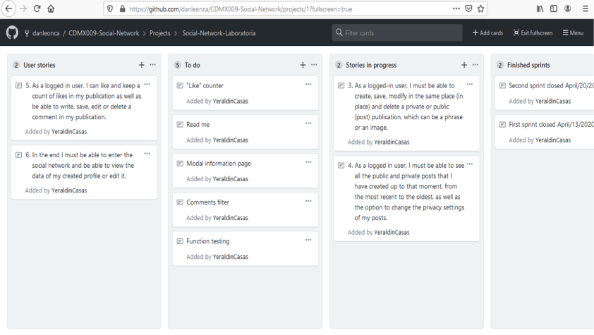
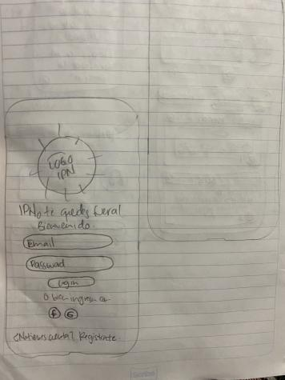
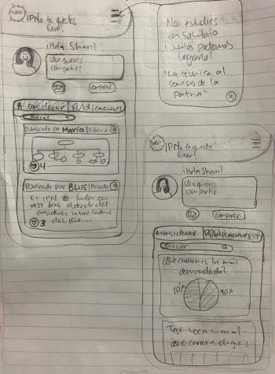
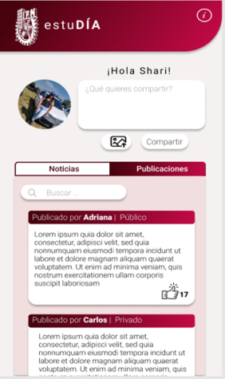
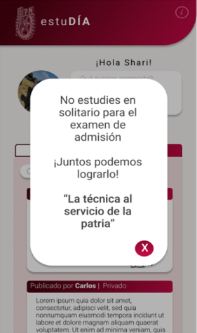

# :book: estuDÍA

The objective of this project is to build a responsive Single-Page Application (SPA) Social Network in which we can write, read, update and delete data. It is the first project on the Laboratory FrontEnd track.
  

### :bulb: IDEA SELECTION
The chosen theme was education. **estuDÍA** is a social network in which users have an interest in entering their university studies specifically at the Instituto Politécnico Nacional.

### :girl: :boy: USERS

**estuDÍa** is aimed at all people regardless of age, sex or occupation who want to pursue higher level studies at the  Instituto Politécnico Nacional. 

### :rotating_light: PROBLEM

In 2019, of the 92 thousand applicants who competed to obtain a place at the top level of the IPN, only 26%, equivalent to 24 thousand young people, had the opportunity to study in one of their 66 careers, in school or non-school modality.

In Mexico, educational quality is poor and is not standardized in schools. In the case of upper secondary education, the study plans vary from one educational institution to another, for example, the study plan of a CONALEP and a COBACH. they are the same and the educational gap is even more pronounced in schools in the interior of the republic.

The UNAM and the IPN two of the best universities in the country have their own upper-middle-level institutions (CCH, ENP and CECYT) in which the study plans are designed so that their graduates are able to take and pass their respective exams admission for higher education. However, many students from the interior of the republic, or from institutions with little educational quality, face a real challenge when it comes to studying and understanding subjects for entrance exams to the IPN or UNAM.

### :computer: WHAT DO WE PROPOSE?

**estuDÍA** is created with the aim of creating a support network so that people interested in carrying out the admission process to the IPN, is a space where users through publications can share, tips, experiences And anything that they think can help others to take a selection exam and start the university stage and thus make the process easier and more solid among applicants.

### :hourglass_flowing_sand: TO WORK!

In order to have a homogeneous distribution of the tasks to be carried out, to be informed of the activities, to contribute ideas, we relied on the GitHub "Pojects" tool, so our SCRUM could be consulted and modified by any of the three team members.

 

### :bust_in_silhouette: USER STORIES

:one: 
**ME** as a new user.
**I WANT** to be able to create an account with valid email and password.
**TO** be able to log in and enter the social network.

:two: 
**ME** as a new user
**I WANT** to have the option to log in with my Google or Facebook account
**TO** enter the social network without creating a valid email account

:three: 
**ME** as a logged in user
**I WANT** to create, save, modify in the same place (in place) and delete a private or public (post) publication, which can be a phrase or an image

:four: 
**ME** As a logged in user
**I WANT** to be able to see all the public and private posts I have created so far, from the most recent to the oldest
**TO** be able to change the privacy settings of my post.

:five: 
**ME** as a logged in user
**I WANT** to like and keep a count of likes in my publication as well as being able to write, save, edit or delete a comment in my publication

:six: 
**ME** as a logged in user
**I WANT** to be able to enter the social network
**TO** be able to view the data of my created profile or edit it.

### :heavy_check_mark: CRITERIA OF ACCEPTANCE

-If the email or password is not valid, when logging in, I should be able to see an error message.
-It should be visible if there is any error message.
-I must be able to see this creation page on Mobile and desktop (responsive).
-You do not need to reload the page to create an account (SPA).
-I must be able to publish text and images.
-The user must be able to filter, edit and delete their publications.

### :heavy_check_mark: DEFINITION OF FINISHING

-The functionality meets satisfies the acceptance criteria.
-The functionality has unit tests.
-The visual design corresponds to the high fidelity prototype.-
-The code of this functionality received code review.
-The functionality is deployed and public to be tested.
-The functionality was manually tested.
-Utility tests were carried out and feedback was implemented if deemed necessary.

### :vhs: LOW-FIDELITY PROTOTYPE

During this stage we designed the user interface, we thought the name of our web application, the distribution of the elements to consult and how it would look on a cell phone screen.

 
 

We sought feedback five times from our bootcamp partners.

### :iphone: HIGH-FIDELITY PROTOTYPE

To develop this part we apply the feedback that our coach and our colleagues gave us, we also take into account the official colors of the National Polytechnic Institute: cherry and white. The hi-fi prototype was developed in Figma.

 
 
 
 

### :pencil: LEARNING OBJECTIVES

### HTML y CSS

* [ ] [semantic HTML](https://developer.mozilla.org/en-US/docs/Glossary/Semantics#Semantics_in_HTML)
* [ ] [CSS `flexbox`](https://css-tricks.com/snippets/css/a-guide-to-flexbox/)
* [ ] Build your application respecting the design made (layout).

### DOM y Web APIs

* [ ] [Dynamic DOM manipulation](https://developer.mozilla.org/es/docs/Referencia_DOM_de_Gecko/Introducci%C3%B3n)
* [ ] [History API](https://developer.mozilla.org/es/docs/DOM/Manipulando_el_historial_del_navegador)
* [ ] [`localStorage`]

### Javascript

* [ ] [Use of callbacks](https://developer.mozilla.org/es/docs/Glossary/Callback_function)
* [ ] [Consumption of Promises](https://scotch.io/tutorials/javascript-promises-for-dummies#toc-consuming-promises)
* [ ] ES modules
([`import`](https://developer.mozilla.org/en-US/docs/Web/JavaScript/Reference/Statements/import)
| [`export`](https://developer.mozilla.org/en-US/docs/Web/JavaScript/Reference/Statements/export))

### Firebase

* [ ] [Firestore](https://firebase.google.com/docs/firestore)
* [ ] [Firebase Auth](https://firebase.google.com/docs/auth/web/start)
* [ ] [Firebase security rules](https://firebase.google.com/docs/rules)
* [ ] [Use of onSnapshot](https://firebase.google.com/docs/firestore/query-data/listen)
| [onAuthStateChanged](https://firebase.google.com/docs/auth/web/start#set_an_authentication_state_observer_and_get_user_data)

### Testing

* [ ] [Testing your functions](https://jestjs.io/docs/es-ES/getting-started)
* [ ] [Asynchronous testing](https://jestjs.io/docs/es-ES/asynchronous)
* [ ] [Mocking](https://jestjs.io/docs/es-ES/manual-mocks)

### Collaboration on Github

* [ ] Branches
* [ ] Pull Requests
* [ ] Tags

### Organization on Github

* [ ] Projects
* [ ] Issues
* [ ] Labels
* [ ] Milestones

### Good development practices

* [ ] Modularization
* [ ] Nomenclature / Semantics
* [ ] Linting

