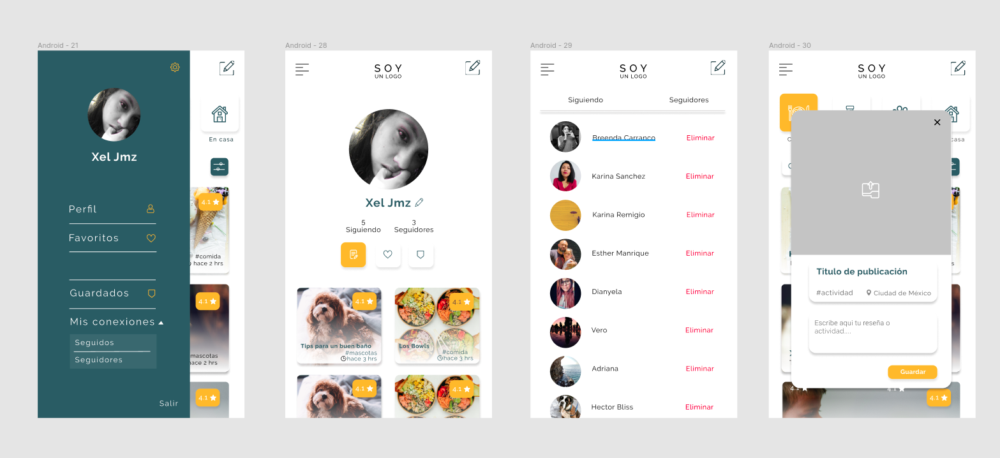

# Civitas - SocialNetwork

Civitas es una app mobile/web desarrollada y pensada como una plataforma de comunicación entre una comunidad, surgió como respuesta a la necesidad de interacción que se ha visto limitada por las medidas de aislamiento derivadas de la pandemia.

A través de ella se puede crear y compartir reseñas de actividades, lugares y servicios de manera local, dependiendo de la ubicación de cada usuario. De esta manera nuestro segundo objetivo es impulsar la economía local.

## Sketchs

Se aterrizó indivualmente la idea de las pantallas para identificar elementos esenciales para reunir en el prototipo de alta fidelidad.

 

 

## Prototipo de alta fidelidad

Integramos los elementos de cada sketch que aportaban más valor a la propuesta de la aplicación, optimizando la navegación y la experiencia del usuario al interactuar con la misma, todo esto tomando en cuenta el feedback recibido por los coaches y las compañeras.

## Objetivos de aprendizaje

Antes de empezar el proyecto, recuerda agregar tus objetivos de aprendizaje pendientes de tu proyecto
anterior en la siguiente sección.

### Objetivos de aprendizajes pendientes

### HTML y CSS

- [x] [HTML semántico](https://developer.mozilla.org/en-US/docs/Glossary/Semantics#Semantics_in_HTML)
- [x] [CSS `flexbox`](https://css-tricks.com/snippets/css/a-guide-to-flexbox/)
- [x] Construir tu aplicación respetando el diseño realizado (maquetación).

### DOM y Web APIs

- [x] [Manipulación dinámica del DOM](https://developer.mozilla.org/es/docs/Referencia_DOM_de_Gecko/Introducci%C3%B3n)
- [x] [History API](https://developer.mozilla.org/es/docs/DOM/Manipulando_el_historial_del_navegador)
- [x] [`localStorage`]

### Javascript

- [x] [Uso de callbacks](https://developer.mozilla.org/es/docs/Glossary/Callback_function)
- [x] [Consumo de Promesas](https://scotch.io/tutorials/javascript-promises-for-dummies#toc-consuming-promises)
- [x] Uso ES modules
      ([`import`](https://developer.mozilla.org/en-US/docs/Web/JavaScript/Reference/Statements/import)
      | [`export`](https://developer.mozilla.org/en-US/docs/Web/JavaScript/Reference/Statements/export))

### Firebase

- [x] [Firestore](https://firebase.google.com/docs/firestore)
- [x] [Firebase Auth](https://firebase.google.com/docs/auth/web/start)
- [x] [Firebase security rules](https://firebase.google.com/docs/rules)
- [x] [Uso de onSnapshot](https://firebase.google.com/docs/firestore/query-data/listen)
      | [onAuthStateChanged](https://firebase.google.com/docs/auth/web/start#set_an_authentication_state_observer_and_get_user_data)

### Testing

- [ ] [Testeo de tus funciones](https://jestjs.io/docs/es-ES/getting-started)
- [ ] [Testeo asíncrono](https://jestjs.io/docs/es-ES/asynchronous)
- [x] [Mocking](https://jestjs.io/docs/es-ES/manual-mocks)

### Colaboración en Github

- [x] Branches
- [x] Pull Requests
- [ ] Tags

### Organización en Github

- [Pildora SPA](https://www.loom.com/share/fa63a8ad0e9a43428222c15b6f6613d3)
- [Repositorio de pildora de SPA](https://github.com/betsyvies/bootcamp-spa)
- [Pildora de mock Firebase](https://www.youtube.com/watch?v=06myVn41OTY&t=1s)
- [Repositorio de pildora de mock Firebase](https://github.com/Danielalab/2018-2-Testing)
- [Pildora MVC](https://github.com/merunga/todomvc-vanillajs)
- [Modulos: Export](https://developer.mozilla.org/es/docs/Web/JavaScript/Referencia/Sentencias/export)
- [Modulos: Import](https://developer.mozilla.org/es/docs/Web/JavaScript/Referencia/Sentencias/import)
- [Diseño web, responsive design y la importancia del mobile first - Media Click](https://www.mediaclick.es/blog/diseno-web-responsive-design-y-la-importancia-del-mobile-first/)
- [Mobile First: el enfoque actual del diseño web móvil - 1and1](https://www.1and1.es/digitalguide/paginas-web/diseno-web/mobile-first-la-nueva-tendencia-del-diseno-web/)
- [Mobile First - desarrolloweb.com](https://desarrolloweb.com/articulos/mobile-first-responsive.html)
- [Mobile First - ZURB](https://zurb.com/word/mobile-first)
- [Mobile First Is NOT Mobile Only - Nielsen Norman Group](https://www.nngroup.com/articles/mobile-first-not-mobile-only/)

---

- [x] Projects
- [ ] Issues
- [ ] Labels
- [ ] Milestones

### Buenas prácticas de desarrollo

- [x] Modularización
- [x] Nomenclatura / Semántica
- [ ] Linting

---
