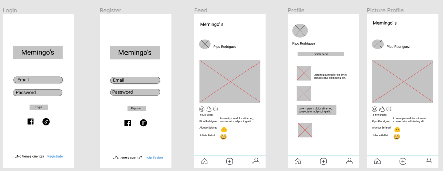
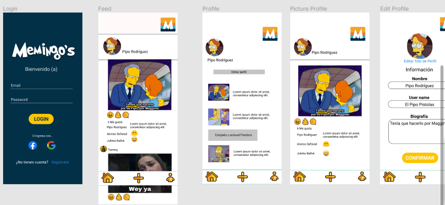

# 😆 Memingo's, la red social de los memes. 💩

### Proceso de Diseño
Desarrollamos una interfaz intuitiva inspirada en las apps de redes sociales más usadas en el mundo para que así, el usuario se sienta cómodo y conozca el entorno de la aplicación. Esta red social está pensada en el público joven.

Comenzamos nuestro prototipo de baja fidelidad en Figma  mostramos este prototipo a diferentes compañeras para recibir feedback y comenzar con nuestro prototipo de alta fidelidad. 

Escribimos nuestras historias de usuario en Trello, dividimos las tareas en unas tareas más pequeñas obteniendo así, un total de seis historias de usuario.
Después de definitir qué era lo que se esperaba que el usuario pudiera manipular en la app desarrollamos nuestro prototipo de alta fidelidad.

Este es nuestro producto final: [Memingo's](https://fasez26.github.io/CDMX009-Social-Network/src/index.html)

### Historias de Usuario

1. Yo como: Usuario nuevo Quiero: Poder crear una cuenta con email y password válidos Para: Poder iniciar sesión e ingresar a la red social.
2. Yo como: Usuario Quiero: Tener la opción de iniciar sesión con mi cuenta de Google o Facebook o con un mail válido Para: Poder ingresar a la red social.
3. Yo como: Usuario Quiero: Poder crear y guardar en el mismo lugar. Para: Eliminar una publicación privada o pública, que pueda ser una frase o imagen.
4. Yo como: Usuario debo de poder ver todos los post que he hecho públicos o privados Para: Cambiar la privacidad de mis publicaciones.
5. Yo como: Usuario Quiero: Dar like a las publicaciones Para: Poder llevar un conteo de likes en mi publicación.
6. Yo como: Usuario Quiero: Poder editar o eliminar un comentario en mi publicación. Para: Interactuar en la red social.

### Objetivos de aprendizajes

### HTML y CSS
        M   D   N 
* [✨] [✨] [✨] [HTML semántico](https://developer.mozilla.org/en-US/docs/Glossary/Semantics#Semantics_in_HTML)
* [✨] [✨] [✨]  [CSS `flexbox`](https://css-tricks.com/snippets/css/a-guide-to-flexbox/)
* [✨] [✨] [✨]  Construir tu aplicación respetando el diseño realizado (maquetación).

### DOM y Web APIs

* [✨] [✨] [✨]  [Manipulación dinámica del DOM](https://developer.mozilla.org/es/docs/Referencia_DOM_de_Gecko/Introducci%C3%B3n)
* [] [ ] [ ]  [History API](https://developer.mozilla.org/es/docs/DOM/Manipulando_el_historial_del_navegador)
* [] [ ] [ ]  [`localStorage`]

### Javascript

* [✨] [✨] [✨]  [Uso de callbacks](https://developer.mozilla.org/es/docs/Glossary/Callback_function)
* [✨] [✨] [✨]  [Consumo de Promesas](https://scotch.io/tutorials/javascript-promises-for-dummies#toc-consuming-promises)
* [✨] [✨] [✨]  Uso ES modules
([`import`](https://developer.mozilla.org/en-US/docs/Web/JavaScript/Reference/Statements/import)
| [`export`](https://developer.mozilla.org/en-US/docs/Web/JavaScript/Reference/Statements/export))

### Firebase

* [✨] [✨] [✨]  [Firestore](https://firebase.google.com/docs/firestore)
* [✨] [✨] [✨]  [Firebase Auth](https://firebase.google.com/docs/auth/web/start)
* [✨] [✨] [✨]  [Firebase security rules](https://firebase.google.com/docs/rules)
* [✨] [✨] [✨]  [Uso de onSnapshot](https://firebase.google.com/docs/firestore/query-data/listen)
| [onAuthStateChanged](https://firebase.google.com/docs/auth/web/start#set_an_authentication_state_observer_and_get_user_data)

### Testing

* [✨] [✨] [✨]  [Testeo de tus funciones](https://jestjs.io/docs/es-ES/getting-started)
* [ ] [ ] [ ]  [Testeo asíncrono](https://jestjs.io/docs/es-ES/asynchronous)
* [ ] [ ] [ ]  [Mocking](https://jestjs.io/docs/es-ES/manual-mocks)

### Colaboración en Github

* [ ] [ ] [ ]  Branches
* [ ] [ ] [ ]  Pull Requests
* [ ] [ ] [ ]  Tags

### Organización en Github

* [✨] [✨] [✨]  Projects
* [ ] [ ] [ ]  Issues
* [ ] [ ] [ ]  Labels
* [ ] [ ] [ ]  Milestones

### Buenas prácticas de desarrollo

* [✨] [✨] [✨]  Modularización
* [✨] [✨] [✨]  Nomenclatura / Semántica
* [✨] [✨] [✨]  Linting

***

